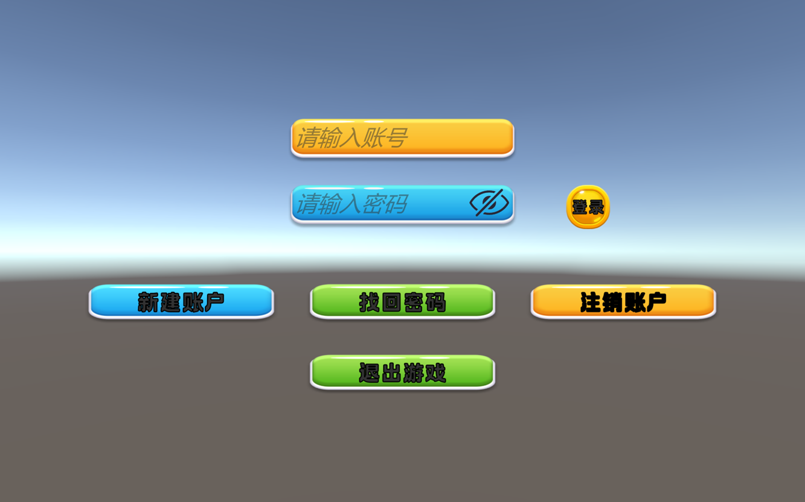
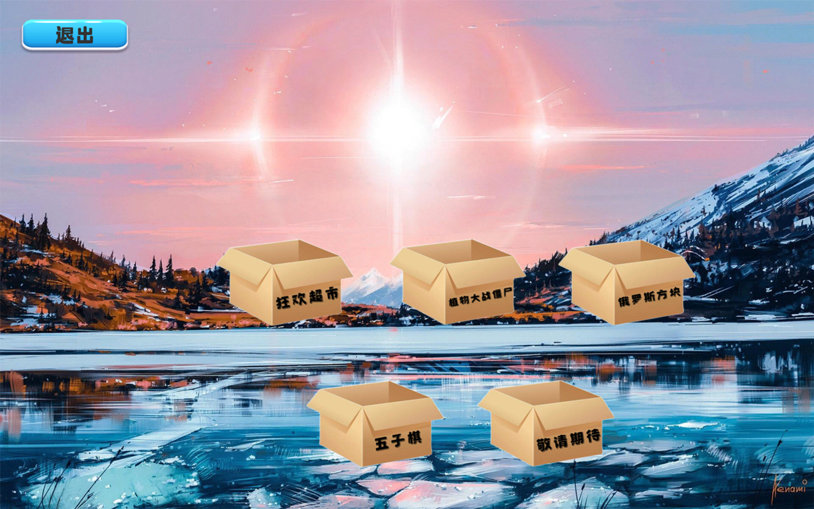
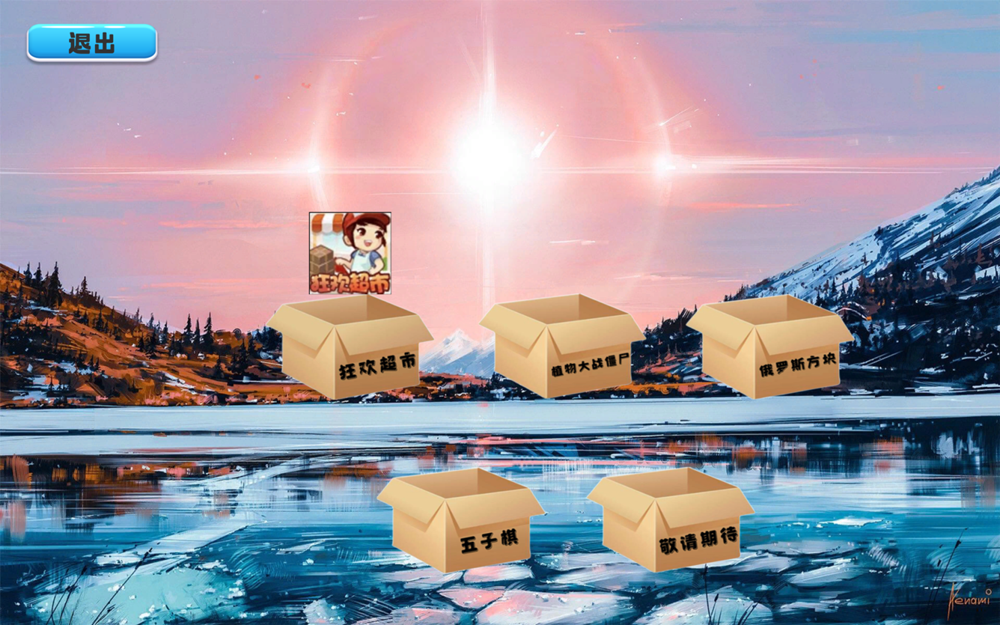
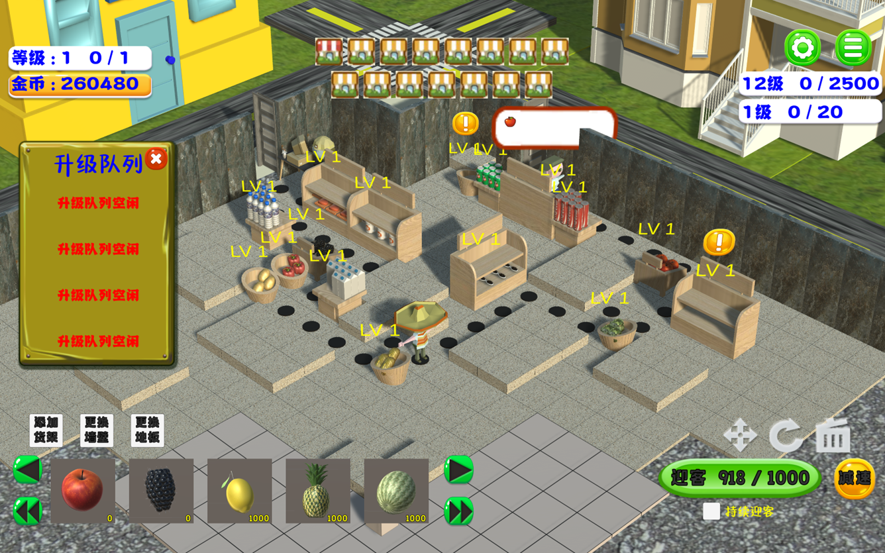
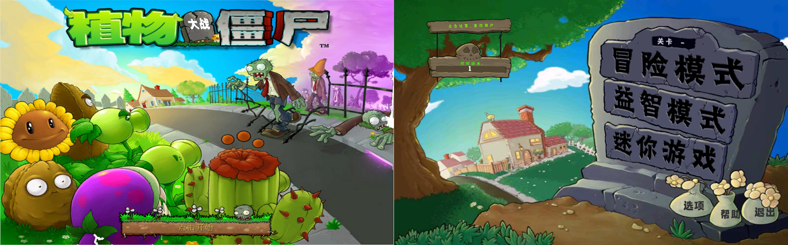
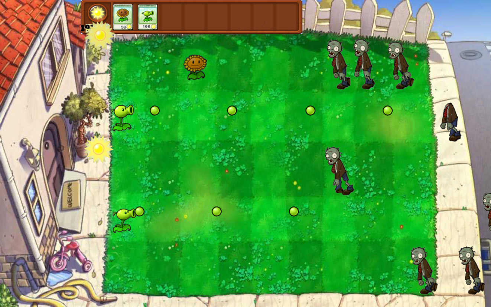
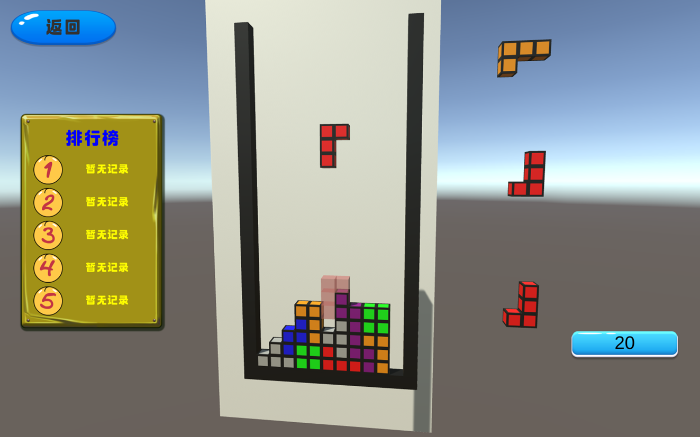
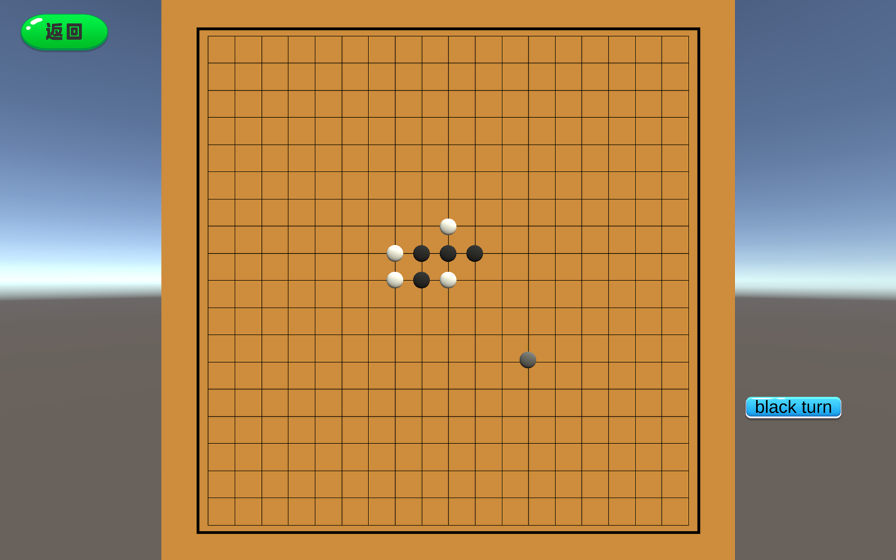
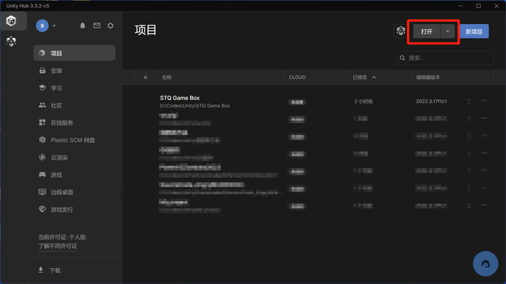
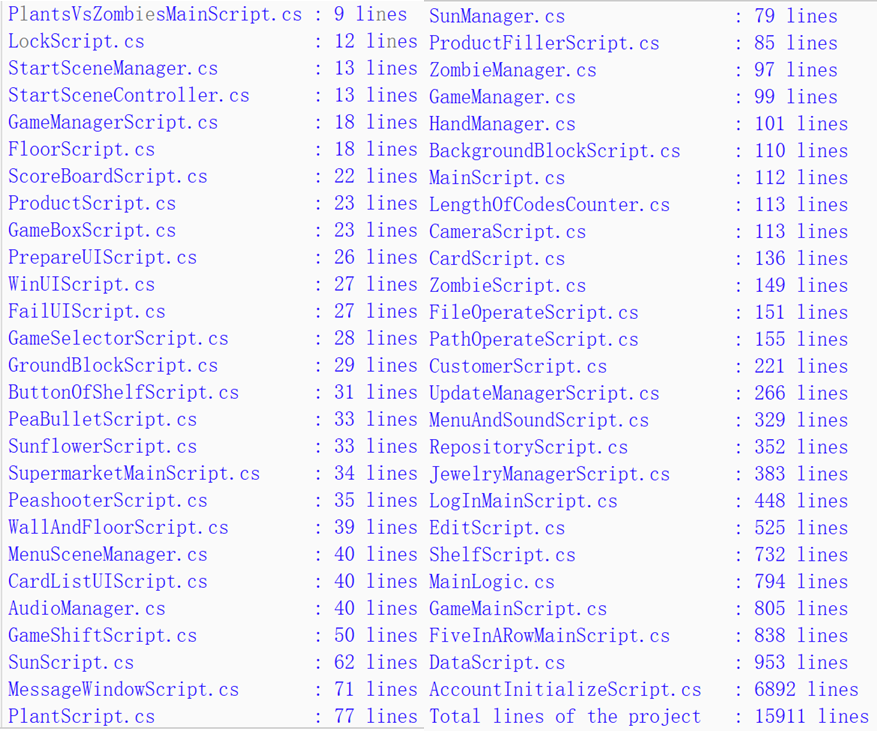

<h1>C#大作业项目报告</h1>

<h2 style="text-align: right">——STQ的游戏盒子</h2>

<h3>制作：邵天奇</h3>

## 目录

- [一、项目整体介绍](#一项目整体介绍)
- [二、项目运行方式](#二项目运行方式)
- [三、完成项目中遇到的困难](#三完成项目中遇到的困难)
- [四、工作量评估](#四工作量评估)
- [五、未来展望](#五未来展望)

## 一、项目整体介绍

### 整体介绍

本项目是一个集成了多款游戏的大型软件，基于Unity开发，全部采用C#编程语言。项目从代码编写、美术设计到前后端架构等全部内容均由我独立完成。

### 项目文件结构介绍

包含以下三项内容：

- **Release**：包含使用Unity构建的可执行程序（.exe），双击即可运行。
- **STQ_Game_Box**：项目文件夹，包含所有代码、资源文件和项目配置等内容。
- **README.md**：用于项目的说明报告（包含具体的操作指南）。

### 前端部分

项目前端主体采用Unity，包含2D的UI界面和3D的游戏场景。主要工作包括：

- **2D UI界面设计**：界面布局设计及对应组件的业务逻辑。
- **3D场景物体布局**：初始场景物体布局，物体的动态移动、创建、销毁，以及物体间的交互（如碰撞、靠近效果等）。

### 后端部分

后端主要处理玩家账号数据。鉴于数据库规模较小，采用.txt文件作为存储方式，数据读取通过C#实现。

### 整体架构

项目整体架构涉及：

- 各类文件的组织，包括资源文件（图片、模型、音乐、字体、动画、Unity材质文件等）。
- 脚本文件的层次划分。
- Unity场景文件的层次结构及切换逻辑设计。

### 美术部分

- **UI图片**：部分从Unity Asset Store下载（如按钮背景等），部分自行绘制（使用画图等软件），还有从网络下载、原版游戏中获取（如植物大战僵尸通过解包main.pak获取原版图片资源）以及直接从游戏中截图得到。
- **3D模型**：使用Blender建模软件创建，部分从开源网站获取。

### 界面展示

- **登录界面**：需先创建账号，账号密码可自定义。
- **游戏选择界面**：可选择想玩的游戏。
- **游戏选择效果**：选择游戏时有相应效果展示。
- **游戏效果图**：依次是狂欢超市、植物大战僵尸、俄罗斯方块、五子棋等游戏界面效果。

## 二、项目运行方式

### 正常游玩

直接打开Release文件夹中的.exe程序即可开始游玩。

### 继续开发

若希望在本项目基础上继续开发，可按以下步骤进行：

1. 下载Unity Hub并注册账号。
2. 点击打开按钮，选择项目所在文件夹。
   
3. 本项目使用Unity 2022.3.17f1c1 编译器，建议使用相同版本以保证稳定性。
4. 将项目添加到Unity Hub后即可进行开发工作。

## 三、完成项目中遇到的困难

### 编程学习

初期学习C#时，面对繁多的概念和强大的功能，上手存在一定难度。但随着学习深入，编程逐渐不再是难题。

### Unity使用

本课程未涉及Unity开发相关内容，需通过自学掌握。自学过程中需平衡时间与课内其他内容，且3D场景、2D UI等新型概念初期较难适应，Unity本身也带来诸多学习挑战。

### 素材获取

- **2D素材**：主要是UI所需的大量图片，通过多渠道获取，包括网络下载、从游戏原始素材中提取等。
- **3D素材**：3D模型部分通过Blender自行建模，部分从网络下载，还有在Unity中直接创建一些简单模型。

## 四、工作量评估

### 代码编写

项目全部代码由我使用C#编写完成。具体的代码量如下：
总行数约为16000行。

### 模型创建

项目中使用的模型均为我创建（或对网络下载的模型进行修改），3D建模较为复杂，是项目不可或缺的重要组成部分。

### 其他工作

除代码编写和模型创建外，还有许多无法直接用代码量衡量的工作，如图片和音乐的挑选与制作、整体项目架构设计、学习成本以及报告撰写等。

## 五、未来展望

- **增加游戏种类**：不断丰富游戏盒子内的游戏类型。
- **完善游戏机制**：如在植物大战僵尸中增加更多关卡场景，在狂欢超市中加入更多玩法等。
- **移动端适配**：考虑向移动端进行适配，扩大用户使用范围。
- **添加联网功能**：提升游戏的互动性和趣味性。